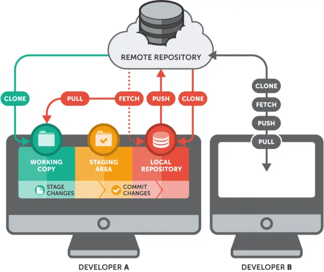

#  GIT 

## *Git là gì*
* Git là một hệ thống quản lý phiên bản phân tán(DVCS - distributed version control system)
* Git là tiêu chuẩn kiểm soát phiên bản cho GitHub và các hệ thống quản lý mã nguồn khác

## *Lợi ích khi sử dụng git*
* Khả năng phân nhánh(branch): Git khác với các phiên bản tập trung khác là việc phân và gộp nhánh được thao tác rất đơn giản
* Khả năng phát triển phân tán (D - Distributed) - Mỗi dev có một kho lưu trữ riêng đầy đủ các lịch sử thay đổi. Do đó các thành
viên có thể làm việc độc lập với nhau sau đó hợp nhánh khi hoàn chỉnh, không cần duy trì liên tục từ nhánh gốc
* Cộng đồng lớn dễ dàng học hỏi cũng như chia sẻ kiến thức kinh nghiệm

## *Những thuật ngữ phổ biến trong Git*
* `Repository`: Nơi lưu trữ mã nguồn của dự án. Có 2 loại là repo là `local repo` và `remote repo`
    * `Local repo`: Là dự án gốc ở máy tính chúng ta
    * `Remote repo`: Là dự án được quản lý bởi Git và được lưu trữ trên Github
* `Branch(nhánh)`: Là các repository tách ra từ repository của project chính
* `Master`: Là nhánh chính của repo
* `Pull`: Pull requests thể hiện các đề xuất thay đổi cho nhánh chính. Nếu bạn làm việc với một nhóm, bạn có thể tạo các pull request để yêu cầu người quản lý kho lưu trữ xem xét các thay đổi và hợp nhất chúng
* `Merge`: Lệnh `git merge` kết hợp với các yêu cầu kéo (pull requests) để thêm các thay đổi từ nhánh này sang nhánh khác
* `Checkout`: Di chuyển qua lại giữa các nhánh
* `Commit`: Một `commit` tương ứng cho việc chúng ta vừa thay đổi điều gì đó trong dự án
* `Push`: Lệnh `git push` là để xác nhận các thay đổi từ dự án 
* `Origin`: Là tên mặc định của remote repo. Lệnh `git push origin master` để đẩy các thay đổi từ local repo đến `remote repo` ở nhánh chính
* `Status`: Các trạng thái của một tệp trong Git
    * `Modified`: Đã có sự thay đổi trong tệp nhưng chưa cập nhật
    * `Staged`: Đã cập nhật(Để cho một file từ trạng thái modified sang staged thì sử dụng lệnhg git add `namefile`)
    * `Commit`: Xác nhận sự cập nhật đó(Để xác nhận ta sử dụng lệnh `git commit`)
* `.ignore`: Các file mà chúng ta không muốn để git quản lý nói cách khác các file này sẽ không được upload lên remote repo trên Github

## *Hình ảnh thể hiện cách hoạt động của git*
 

## *Một số lệnh Git cơ bản*
* `git config`: Lệnh này được dùng để set tên author name và email tương ứng sẽ được sử dụng trong commit
    * Cú pháp chi tiết: 
        * `git config –global user.name “[name]”`
        * `git config –global user.email “[email address]"`
* `git status`: Sử dụng để biết thông tin trạng thái sửa đổi, thêm mới, xóa các file trước khi thực hiện commit
* `git init`: Lệnh này được sử dụng để khởi tạo một repository mới
* `git remote add origin "[url]"`: Lệnh đưa một local repo lên github. repo trên github là remote repo
* `git clone "[url(link remote repo)]"`: Lệnh được sử dụng để sao chép một repo hiện có 
* `git add "[namefile]"`: Lệnh được sử dụng để đưa file vào trạng thái chuẩn bị commit - `Staged`
* `git commit -m "[message]"`: Xác nhận sự thay đổi với message tương ứng 
* `git push origin master`: Xác nhận sự thay đổi và cập nhật trên nhánh master(nhánh chính) của remote repo
* `git branch`: Lệnh để xem số lượng nhánh của một dự án
* `git branch "[name branch]"`: Lệnh tạo nhánh 
* `git checkout "[name branch]"`: Lệnh di chuyển qua lại giữa các nhánh
* `git merge "[name branch]"`: Lệnh hợp nhất các sự thay đôi của nhánh để đưa vào nhánh chính
* `git pull origin master`: Cập nhật sự thay đổi từ remote repo về local repo

*Made by Nguyen Huu Nhan*